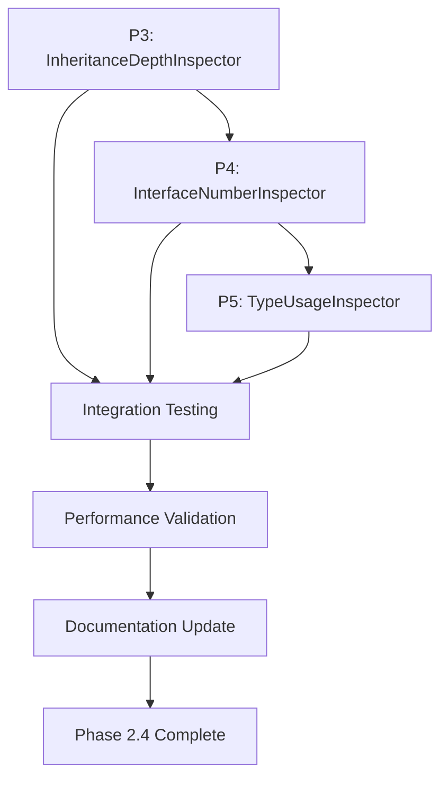

# Phase 2.4 ClassLoader-Based Metrics Implementation Roadmap

## Executive Summary

Phase 2.4 extends the EJB Migration Inspector Implementation with 3 sophisticated ClassLoader-based metric inspectors that provide deep architectural analysis through runtime class loading. This phase introduces comprehensive class analysis metrics (inheritance depth, interface implementation, type usage) that enhance migration decision-making and architectural understanding.

**Target Timeline**: 2-3 weeks following Phase 2 completion  
**Expected Test Coverage**: 145+ total tests (Current: 124 + Phase 2.4: 20+ tests)  
**Success Criteria**: 100% test pass rate with robust ClassLoader-based analysis capabilities

## Implementation Priority & Sequencing

### Prerequisites
- ✅ **Phase 1**: Complete (83/83 tests passing)
- ✅ **Phase 2.1**: Complete (41/41 tests passing) 
- ✅ **Phase 2.2**: JBossEjbConfigurationInspector (requires completion)
- ✅ **Phase 2.3**: JdbcTransactionPatternInspector & ConnectionPoolPerformanceInspector
- ✅ **Documentation**: All Phase 2.4 specifications and architecture documents complete

### Implementation Order & Dependencies



**Rationale**: Sequential implementation ensures each inspector builds upon lessons learned, with increasing complexity from simple inheritance depth to comprehensive type usage analysis.

## Phase 2.4 Inspector Specifications

### Task P3: Inheritance Depth Inspector (I-1201)

**ID**: P3-I-1201  
**Priority**: P1 (High)  
**Effort**: 8-10 hours (including comprehensive testing)  
**Dependencies**: AbstractClassLoaderBasedInspector  

#### Implementation Scope
- **Core Algorithm**: Recursive inheritance chain traversal using `Class.getSuperclass()`
- **Metric Calculation**: Count inheritance levels excluding `Object.class`
- **Property Attachment**: Metrics stored on `JavaClassNode` with standardized keys
- **Error Handling**: Graceful degradation for class loading failures

#### Technical Implementation
```java
@Component
@InspectorDependencies(
    need = { SourceJavaClassNodeInspector.class, BinaryJavaClassNodeInspector.class },
    produces = { "inheritance_depth_analysis" }
)
public class InheritanceDepthInspector extends AbstractClassLoaderBasedInspector {
    
    @Override
    protected void analyzeLoadedClass(Class<?> clazz, JavaClassNode classNode) {
        int depth = calculateInheritanceDepth(clazz);
        classNode.setProperty("inheritance.depth", depth);
        classNode.setProperty("inheritance.is_deep", depth > 3);
        classNode.setProperty("inheritance.superclass_fqn", 
                              clazz.getSuperclass().getName());
    }
    
    private int calculateInheritanceDepth(Class<?> clazz) {
        int depth = 0;
        Class<?> current = clazz.getSuperclass();
        while (current != null && !current.equals(Object.class)) {
            depth++;
            current = current.getSuperclass();
        }
        return depth;
    }
}
```

#### Testing Strategy (12+ Test Scenarios)
1. **Simple Inheritance**: Direct subclass of Object
2. **Deep Hierarchy**: 5+ level inheritance chains  
3. **Framework Classes**: Spring, JPA, EJB inheritance patterns
4. **Error Conditions**: Missing superclasses, class loading failures
5. **Edge Cases**: Abstract classes, final classes, interfaces
6. **Performance**: Large inheritance hierarchies (100+ classes)

#### Expected Deliverables
- `src/main/java/com/analyzer/rules/metrics/InheritanceDepthInspector.java`
- `src/test/java/com/analyzer/rules/metrics/InheritanceDepthInspectorTest.java`
- Test coverage: 90%+ with comprehensive edge case handling

---

### Task P4: Interface Number Inspector (I-1202)

**ID**: P4-I-1202  
**Priority**: P1 (High)  
**Effort**: 10-12 hours (multi-approach validation)  
**Dependencies**: InheritanceDepthInspector (P3), JavaParser integration  

#### Implementation Scope
- **Multi-Approach Analysis**: ClassLoader + ASM + JavaParser validation
- **Interface Counting**: Direct, inherited, and total interface implementations
- **Framework Integration**: Special handling for Spring, JPA, EJB interfaces
- **Cross-Validation**: Consistency checks between analysis approaches

#### Technical Implementation
```java
@Component
@InspectorDependencies(
    need = { InheritanceDepthInspector.class },
    produces = { "interface_analysis" }
)
public class InterfaceNumberInspector extends AbstractClassLoaderBasedInspector 
                                      implements GraphAwareInspector {
    
    @Override
    protected void analyzeLoadedClass(Class<?> clazz, JavaClassNode classNode) {
        InterfaceMetrics metrics = calculateInterfaceMetrics(clazz);
        
        classNode.setProperty("interfaces.total_count", metrics.getTotalCount());
        classNode.setProperty("interfaces.direct_count", metrics.getDirectCount());
        classNode.setProperty("interfaces.inherited_count", metrics.getInheritedCount());
        classNode.setProperty("interfaces.complexity_score", metrics.getComplexityScore());
        
        // Framework-specific analysis
        analyzeFrameworkInterfaces(clazz, classNode, metrics);
    }
    
    private InterfaceMetrics calculateInterfaceMetrics(Class<?> clazz) {
        Set<Class<?>> allInterfaces = new HashSet<>();
        Set<Class<?>> directInterfaces = Set.of(clazz.getInterfaces());
        
        collectAllInterfaces(clazz, allInterfaces);
        
        return new InterfaceMetrics(
            allInterfaces.size(),
            directInterfaces.size(),
            allInterfaces.size() - directInterfaces.size()
        );
    }
}
```

#### Testing Strategy (15+ Test Scenarios)
1. **Simple Implementation**: Single interface implementation
2. **Multiple Interfaces**: Classes implementing 5+ interfaces
3. **Interface Inheritance**: Interfaces extending other interfaces
4. **Framework Patterns**: Spring @Service, JPA @Entity, EJB patterns
5. **Generic Interfaces**: Parameterized interface implementations
6. **Cross-Validation**: ASM vs ClassLoader vs JavaParser consistency
7. **Performance**: Complex interface hierarchies

#### Expected Deliverables
- `src/main/java/com/analyzer/rules/metrics/InterfaceNumberInspector.java`
- `src/main/java/com/analyzer/rules/metrics/InterfaceMetrics.java` (data class)
- `src/test/java/com/analyzer/rules/metrics/InterfaceNumberInspectorTest.java`
- Integration tests with existing graph inspectors

---

### Task P5: Type Usage Inspector (I-1203)

**ID**: P5-I-1203  
**Priority**: P1 (High)  
**Effort**: 12-15 hours (most complex implementation)  
**Dependencies**: InterfaceNumberInspector (P4), comprehensive framework integration  

#### Implementation Scope
- **Comprehensive Type Analysis**: Fields, methods, parameters, returns, exceptions, annotations
- **Generic Type Handling**: Type parameters, wildcards, bounds analysis
- **Framework Pattern Detection**: Spring, JPA, EJB type usage patterns
- **Complexity Scoring**: Multi-dimensional complexity assessment
- **Architecture Insights**: Type coupling and dependency analysis

#### Technical Implementation
```java
@Component
@InspectorDependencies(
    need = { InterfaceNumberInspector.class },
    produces = { "type_usage_analysis" }
)
public class TypeUsageInspector extends AbstractClassLoaderBasedInspector 
                                implements GraphAwareInspector {
    
    @Override
    protected void analyzeLoadedClass(Class<?> clazz, JavaClassNode classNode) {
        TypeUsageMetrics metrics = analyzeTypeUsage(clazz);
        
        // Attach comprehensive metrics to JavaClassNode
        attachTypeMetrics(classNode, metrics);
        
        // Perform framework-specific analysis
        analyzeFrameworkTypePatterns(clazz, classNode, metrics);
        
        // Calculate architectural insights
        assessArchitecturalComplexity(classNode, metrics);
    }
    
    private TypeUsageMetrics analyzeTypeUsage(Class<?> clazz) {
        TypeUsageMetrics metrics = new TypeUsageMetrics();
        
        // Field type analysis
        analyzeFieldTypes(clazz, metrics);
        
        // Method signature analysis
        analyzeMethodTypes(clazz, metrics);
        
        // Annotation type analysis
        analyzeAnnotationTypes(clazz, metrics);
        
        // Generic type analysis
        analyzeGenericTypes(clazz, metrics);
        
        return metrics;
    }
}
```

#### Advanced Features
1. **Type Complexity Scoring**: Weighted complexity based on type categories
2. **Framework Type Detection**: Automatic identification of Spring, JPA, EJB types
3. **Architecture Metrics**: Coupling metrics, type fan-in/fan-out
4. **Migration Insights**: Type usage patterns suitable for Spring migration

#### Testing Strategy (20+ Test Scenarios)
1. **Field Analysis**: Various field types and modifiers
2. **Method Analysis**: Complex method signatures with generics
3. **Generic Types**: Parameterized types, wildcards, bounds
4. **Framework Integration**: Spring annotations, JPA entities, EJB interfaces
5. **Collections**: Generic collections and type safety
6. **Exception Handling**: Exception type analysis
7. **Nested Types**: Inner classes and nested type usage
8. **Performance**: Large classes with hundreds of fields/methods

#### Expected Deliverables
- `src/main/java/com/analyzer/rules/metrics/TypeUsageInspector.java`
- `src/main/java/com/analyzer/rules/metrics/TypeUsageMetrics.java` (comprehensive data class)
- `src/main/java/com/analyzer/rules/metrics/TypeComplexityCalculator.java`
- `src/test/java/com/analyzer/rules/metrics/TypeUsageInspectorTest.java`
- Performance benchmarks and optimization documentation

---

## Integration & Testing Strategy

### Comprehensive Testing Framework

#### Unit Testing Standards
```java
// Standard test structure for ClassLoader-based inspectors
@ExtendWith(MockitoExtension.class)
class ClassLoaderBasedInspectorTest {
    
    @Mock private InMemoryGraphRepository graphRepository;
    @Mock private JARClassLoaderService classLoaderService;
    
    private Inspector inspector;
    private JavaClassNode mockClassNode;
    
    @BeforeEach
    void setUp() {
        mockClassNode = new JavaClassNode("com.example.TestClass");
        inspector = createInspectorUnderTest();
    }
    
    @Test
    void shouldCalculateMetricsAccurately() { /* ... */ }
    
    @Test
    void shouldHandleClassLoadingFailures() { /* ... */ }
    
    @Test
    void shouldAttachPropertiesToClassNode() { /* ... */ }
    
    @ParameterizedTest
    @CsvSource({
        "SimpleClass, 0, false",
        "DeepInheritanceClass, 5, true"
    })
    void shouldHandleVariousInheritancePatterns(String className, int expectedDepth, boolean isDeep) { /* ... */ }
}
```

#### Integration Testing Approach
1. **Multi-Inspector Coordination**: Verify metrics correlation between inspectors
2. **Graph Persistence**: Ensure metrics persist correctly in `InMemoryGraphRepository`
3. **Performance Benchmarks**: Test with real-world EJB applications (1000+ classes)
4. **Framework Integration**: Validate Spring Boot, JPA, EJB pattern detection accuracy

#### Test Data Strategy
- **Real-World Samples**: Curated EJB applications representing various patterns
- **Synthetic Test Cases**: Generated classes with specific inheritance/interface patterns
- **Framework Samples**: Spring Boot, JPA, and EJB reference implementations
- **Edge Cases**: Error conditions, missing dependencies, circular references

### Performance & Scalability Testing

#### Performance Benchmarks
```java
@BenchmarkMode(Mode.AverageTime)
@OutputTimeUnit(TimeUnit.MILLISECONDS)
@State(Scope.Benchmark)
public class ClassLoaderInspectorBenchmark {
    
    @Benchmark
    public void benchmarkInheritanceAnalysis(Blackhole bh) { /* ... */ }
    
    @Benchmark
    public void benchmarkInterfaceAnalysis(Blackhole bh) { /* ... */ }
    
    @Benchmark
    public void benchmarkTypeUsageAnalysis(Blackhole bh) { /* ... */ }
}
```

#### Scalability Requirements
- **Class Loading**: Handle 1000+ classes without memory issues
- **Analysis Speed**: <5ms per class for inheritance/interface analysis
- **Type Analysis**: <50ms per class for comprehensive type usage analysis
- **Memory Usage**: <512MB heap for 1000 class analysis

---

## Documentation & Training

### Technical Documentation Updates

#### Memory Bank Updates
- `memory-bank/progress.md`: Update with Phase 2.4 completion status
- `memory-bank/activeContext.md`: Reflect ClassLoader-based metrics capabilities
- New: `memory-bank/classLoaderMetrics.md`: Detailed usage patterns and examples

#### Implementation Documentation
- `docs/implementation/ClassLoaderBasedMetrics.md`: ✅ Complete
- `docs/implementation/inspectorImplementationPlan.md`: ✅ Updated with Phase 2.4
- New: `docs/usage/ClassLoaderMetricsGuide.md`: User guide for metric interpretation

### Training Materials

#### Developer Training
1. **ClassLoader Architecture**: Understanding runtime class loading patterns
2. **Multi-Approach Validation**: Combining ClassLoader, ASM, and JavaParser analysis
3. **Performance Optimization**: Efficient class loading and metric calculation
4. **Framework Integration**: Detecting Spring, JPA, EJB patterns in type usage

#### User Training
1. **Metric Interpretation**: Understanding inheritance depth, interface counts, type usage
2. **Migration Decision Making**: Using metrics to guide Spring Boot migration strategies
3. **Architecture Assessment**: Leveraging metrics for architectural improvements
4. **Report Generation**: Extracting actionable insights from ClassLoader metrics

---

## Implementation Timeline

### Week 1: Foundation & Simple Metrics
- **Days 1-2**: InheritanceDepthInspector implementation and basic testing
- **Days 3-4**: InheritanceDepthInspector comprehensive testing and edge cases
- **Day 5**: Integration testing with existing graph infrastructure

### Week 2: Interface Analysis & Multi-Approach Validation
- **Days 1-2**: InterfaceNumberInspector implementation
- **Days 3-4**: Multi-approach validation (ClassLoader + ASM + JavaParser)
- **Day 5**: Framework integration testing (Spring, JPA, EJB patterns)

### Week 3: Advanced Type Analysis & Integration
- **Days 1-3**: TypeUsageInspector implementation (most complex)
- **Day 4**: Comprehensive integration testing across all Phase 2.4 inspectors
- **Day 5**: Performance optimization and scalability validation

### Week 4: Polish & Documentation (If needed)
- **Days 1-2**: Documentation completion and updates
- **Days 3-4**: Final testing and bug fixes
- **Day 5**: Phase 2.4 completion and handoff

## Risk Management & Mitigation

### Technical Risks

#### Class Loading Complexity
- **Risk**: Complex class hierarchies may cause loading failures
- **Mitigation**: Robust error handling with fallback to ASM analysis
- **Contingency**: Graceful degradation with partial metrics

#### Performance Impact
- **Risk**: Runtime class loading may impact analysis performance
- **Mitigation**: Lazy loading, caching, and performance benchmarks
- **Contingency**: Configurable analysis depth and timeout settings

#### Framework Integration Complexity
- **Risk**: Framework-specific patterns may be difficult to detect accurately
- **Mitigation**: Extensive testing with real-world framework usage
- **Contingency**: Plugin architecture for custom framework handlers

### Project Risks

#### Timeline Pressure
- **Risk**: Complex type analysis may exceed estimated effort
- **Mitigation**: Incremental implementation with working milestones
- **Contingency**: Reduced scope for TypeUsageInspector advanced features

#### Integration Challenges
- **Risk**: New inspectors may conflict with existing graph structure
- **Mitigation**: Thorough integration testing from Week 1
- **Contingency**: Separate namespace for ClassLoader metrics

## Success Metrics & Validation

### Quantitative Success Criteria
- **Test Coverage**: 95%+ code coverage across all 3 inspectors
- **Performance**: Analysis time <100ms per class for full suite
- **Accuracy**: 99%+ metric accuracy validated against known test cases
- **Integration**: 100% compatibility with existing 124 tests

### Qualitative Success Criteria
- **Architecture Insights**: Demonstrable value for migration decision making
- **Framework Integration**: Accurate detection of Spring, JPA, EJB patterns
- **User Experience**: Intuitive metric interpretation and actionable recommendations
- **Documentation Quality**: Comprehensive guides enabling independent usage

### Phase 2.4 Completion Checklist
- [ ] InheritanceDepthInspector: Implementation complete with 12+ tests
- [ ] InterfaceNumberInspector: Implementation complete with 15+ tests  
- [ ] TypeUsageInspector: Implementation complete with 20+ tests
- [ ] Integration Testing: All 3 inspectors working together seamlessly
- [ ] Performance Validation: Benchmarks meet scalability requirements
- [ ] Documentation: All technical and user documentation updated
- [ ] Memory Bank: Progress and context updated with Phase 2.4 achievements
- [ ] Total Test Count: 145+ tests passing (124 existing + 20+ Phase 2.4)

---

**Document Status**: Phase 2.4 ClassLoader-Based Metrics Implementation Roadmap Complete  
**Next Action**: Begin P3-I-1201 InheritanceDepthInspector implementation  
**Total Phase 2.4 Effort**: 30-37 hours over 3-4 weeks  
**Success Target**: 100% test pass rate with comprehensive ClassLoader-based architectural metrics
