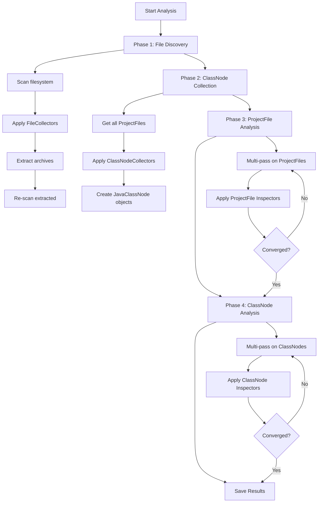

# Collector Architecture Refactoring

**Status:** Planning  
**Created:** October 21, 2025  
**Priority:** High  
**Estimated Effort:** 3-5 days

## Executive Summary

### Problem Statement

The current `AnalysisEngine` implementation is incomplete according to the documented architecture. It only implements phases for ProjectFile discovery and analysis, but is missing the critical phases for ClassNode collection and analysis.

**Current Flow (Incomplete):**
```
Phase 1: File Discovery ✓
  └── Scan and tag ProjectFiles

Phase 2: Multi-Pass ProjectFile Analysis ✓
  └── Analyze ProjectFiles until convergence
```

**Required Flow (Per Documentation):**
```
Phase 1: File Discovery ✓
  └── Scan and tag ProjectFiles

Phase 2: ClassNode Collection ✗ MISSING
  └── Create JavaClassNode objects from ProjectFiles

Phase 3: Multi-Pass ProjectFile Analysis ✓
  └── Analyze ProjectFiles until convergence

Phase 4: Multi-Pass ClassNode Analysis ✗ MISSING
  └── Analyze JavaClassNode objects until convergence
```

### Core Issue

The system currently conflates two distinct responsibilities:
1. **Node Creation** - Creating JavaClassNode objects from ProjectFiles
2. **Node Analysis** - Analyzing existing nodes to extract properties/tags

Both are currently handled by `Inspector<T>` which leads to:
- Unclear separation of concerns
- Missing ClassNode analysis phase
- Difficulty understanding when nodes are created vs. analyzed

### Solution

Introduce a new `Collector<S, T>` abstraction separate from `Inspector<T>`:
- **Collectors** - Create nodes (e.g., ProjectFile → JavaClassNode)
- **Inspectors** - Analyze nodes (e.g., JavaClassNode → tags/properties)

This enables the proper 4-phase architecture documented in the specifications.

### Impact & Benefits

**Benefits:**
- Clear separation between creation and analysis
- Proper multi-pass analysis for ClassNodes
- Better convergence detection
- Easier to understand and maintain
- Aligns code with documented architecture

**Breaking Changes:**
- Inspector registry needs updates
- Some existing inspectors need conversion to collectors
- Configuration/dependency injection may need updates

## Architecture Changes

### New Collector Interface Hierarchy

```java
/**
 * Responsible for CREATING nodes of type T from source S
 */
public interface Collector<S, T> {
    String getName();
    boolean canCollect(S source);
    void collect(S source, CollectionContext context);
}

// Specific collector types
interface FileCollector extends Collector<Path, ProjectFile>
interface ClassNodeCollector extends Collector<ProjectFile, JavaClassNode>

// Abstract base classes
abstract class AbstractBinaryClassCollector implements ClassNodeCollector
abstract class AbstractSourceClassCollector implements ClassNodeCollector
```

### Inspector Remains for Analysis

```java
/**
 * Responsible for ANALYZING existing nodes of type T
 */
public interface Inspector<T> {
    String getName();
    boolean canProcess(T target);
    void inspect(T target, NodeDecorator<T> decorator);
}

// Existing hierarchy remains
abstract class AbstractJavaClassInspector implements Inspector<JavaClassNode>
abstract class AbstractASMClassInspector extends AbstractJavaClassInspector
abstract class AbstractJavaParserInspector extends AbstractJavaClassInspector
```

### Updated AnalysisEngine Flow



### CollectionContext Helper

```java
/**
 * Context provided to Collectors for accessing repositories
 */
public class CollectionContext {
    private final ProjectFileRepository projectFileRepository;
    private final ClassNodeRepository classNodeRepository;
    
    public CollectionContext(ProjectFileRepository fileRepo, 
                            ClassNodeRepository classRepo) {
        this.projectFileRepository = fileRepo;
        this.classNodeRepository = classRepo;
    }
    
    // Helper methods for collectors
    public void addClassNode(JavaClassNode node) {
        classNodeRepository.addNode(node);
    }
    
    public void linkClassNodeToFile(JavaClassNode node, ProjectFile file) {
        projectFileRepository.linkClassNodeToFile(file, node);
    }
    
    public ProjectFile getProjectFile(String path) {
        return projectFileRepository.findByPath(Paths.get(path)).orElse(null);
    }
}
```

## Technical Specifications

### Phase 2: ClassNode Collection

```java
private void collectClassNodesFromFiles(Project project) {
    logger.info("=== PHASE 2: ClassNode Collection ===");
    
    List<ClassNodeCollector> collectors = getClassNodeCollectors();
    
    logger.info("Using {} ClassNode collectors", collectors.size());
    
    CollectionContext context = new CollectionContext(
        projectFileRepository,
        classNodeRepository
    );
    
    try (ProgressBar pb = new ProgressBar("Phase 2: Collecting Classes", 
                                          project.getProjectFiles().size())) {
        for (ProjectFile projectFile : project.getProjectFiles().values()) {
            for (ClassNodeCollector collector : collectors) {
                try {
                    if (collector.canCollect(projectFile)) {
                        collector.collect(projectFile, context);
                        logger.debug("Collector {} created nodes from {}",
                                   collector.getName(), 
                                   projectFile.getRelativePath());
                    }
                } catch (Exception e) {
                    logger.error("Error in collector {} on file {}: {}",
                               collector.getName(),
                               projectFile.getRelativePath(),
                               e.getMessage());
                }
            }
            pb.step();
        }
    }
    
    int classCount = classNodeRepository.getNodeCount();
    logger.info("Phase 2 completed: {} JavaClassNode objects created", classCount);
}
```

### Phase 4: Multi-Pass ClassNode Analysis

```java
private void executeMultiPassOnClassNodes(Project project,
                                         List<String> requestedInspectors,
                                         int maxPasses) {
    logger.info("=== PHASE 4: Multi-pass ClassNode Analysis ===");
    
    List<Inspector<JavaClassNode>> inspectors = 
        getClassNodeInspectors(requestedInspectors);
    
    if (inspectors.isEmpty()) {
        logger.warn("No ClassNode inspectors found");
        return;
    }
    
    Collection<JavaClassNode> classNodes = classNodeRepository.getAllNodes();
    
    logger.info("Executing {} inspectors on {} class nodes (max passes: {})",
                inspectors.size(), classNodes.size(), maxPasses);
    
    ExecutionProfile executionProfile = new ExecutionProfile(
        inspectors.stream().map(Inspector::getName).toList()
    );
    
    int pass = 1;
    boolean hasChanges = true;
    
    while (hasChanges && pass <= maxPasses) {
        logger.info("=== Pass {} of {} ===", pass, maxPasses);
        
        LocalDateTime passStartTime = LocalDateTime.now();
        int nodesProcessed = 0;
        int nodesSkipped = 0;
        Set<String> triggeredInspectors = new HashSet<>();
        
        try (ProgressBar pb = new ProgressBar("Pass " + pass, classNodes.size())) {
            for (JavaClassNode classNode : classNodes) {
                boolean nodeProcessed = false;
                
                for (Inspector<JavaClassNode> inspector : inspectors) {
                    String inspectorName = inspector.getName();
                    
                    // Check convergence - skip if up-to-date
                    if (classNode.isInspectorUpToDate(inspectorName)) {
                        continue;
                    }
                    
                    if (inspector.canProcess(classNode)) {
                        long startTime = System.nanoTime();
                        
                        NodeDecorator<JavaClassNode> decorator = 
                            new NodeDecorator<>(classNode);
                        inspector.inspect(classNode, decorator);
                        
                        long executionTime = System.nanoTime() - startTime;
                        executionProfile.recordInspectorExecution(
                            inspectorName,
                            ExecutionProfile.ExecutionPhase.PHASE_4_CLASSNODE_ANALYSIS,
                            executionTime
                        );
                        
                        classNode.markInspectorExecuted(inspectorName, passStartTime);
                        triggeredInspectors.add(inspectorName);
                        nodeProcessed = true;
                    }
                }
                
                if (nodeProcessed) {
                    nodesProcessed++;
                } else {
                    nodesSkipped++;
                }
                
                pb.step();
            }
        }
        
        logger.info("Pass {} completed: {} nodes processed, {} skipped",
                    pass, nodesProcessed, nodesSkipped);
        
        if (!triggeredInspectors.isEmpty()) {
            logger.info("Pass {} triggered inspectors: [{}]", pass,
                       String.join(", ", triggeredInspectors.stream().sorted().toList()));
        }
        
        // Check convergence
        hasChanges = nodesProcessed > 0;
        
        if (!hasChanges) {
            logger.info("Convergence achieved after {} passes", pass);
            break;
        }
        
        pass++;
    }
    
    if (pass > maxPasses) {
        logger.warn("Reached maximum passes ({}) without full convergence", maxPasses);
    }
    
    executionProfile.setAnalysisMetrics(pass - 1, classNodes.size());
    executionProfile.markAnalysisComplete();
    executionProfile.logReport();
}
```

### Convergence Tracking in JavaClassNode

```java
public class JavaClassNode extends BaseGraphNode {
    // Existing fields...
    
    /**
     * Tracks when each inspector last executed on this node
     */
    private final Map<String, LocalDateTime> lastInspectorExecution = new HashMap<>();
    
    /**
     * Check if an inspector is up-to-date for this node
     */
    public boolean isInspectorUpToDate(String inspectorName) {
        LocalDateTime lastExecution = lastInspectorExecution.get(inspectorName);
        if (lastExecution == null) {
            return false; // Never executed
        }
        
        // Check if node or its dependencies changed since last execution
        LocalDateTime lastModified = getLastModified();
        return lastExecution.isAfter(lastModified);
    }
    
    /**
     * Mark an inspector as executed at a specific time
     */
    public void markInspectorExecuted(String inspectorName, LocalDateTime executionTime) {
        lastInspectorExecution.put(inspectorName, executionTime);
    }
    
    /**
     * Get last modification time (for convergence detection)
     */
    public LocalDateTime getLastModified() {
        // Return most recent change to properties or tags
        return this.lastModifiedTime;
    }
}
```

### Updated InspectorRegistry

```java
public class InspectorRegistry {
    // Existing inspector storage
    private final Map<String, Inspector<?>> inspectors = new HashMap<>();
    
    // NEW: Collector storage
    private final Map<String, Collector<?, ?>> collectors = new HashMap<>();
    
    // Register collectors by type
    public void registerFileCollector(FileCollector collector) {
        collectors.put(collector.getName(), collector);
    }
    
    public void registerClassNodeCollector(ClassNodeCollector collector) {
        collectors.put(collector.getName(), collector);
    }
    
    // Register inspectors by type (existing)
    public void registerFileInspector(Inspector<ProjectFile> inspector) {
        inspectors.put(inspector.getName(), inspector);
    }
    
    public void registerClassNodeInspector(Inspector<JavaClassNode> inspector) {
        inspectors.put(inspector.getName(), inspector);
    }
    
    // Retrieve collectors
    @SuppressWarnings("unchecked")
    public List<FileCollector> getFileCollectors() {
        return collectors.values().stream()
            .filter(c -> c instanceof FileCollector)
            .map(c -> (FileCollector) c)
            .toList();
    }
    
    @SuppressWarnings("unchecked")
    public List<ClassNodeCollector> getClassNodeCollectors() {
        return collectors.values().stream()
            .filter(c -> c instanceof ClassNodeCollector)
            .map(c -> (ClassNodeCollector) c)
            .toList();
    }
    
    // Retrieve inspectors (updated for type safety)
    @SuppressWarnings("unchecked")
    public List<Inspector<ProjectFile>> getFileInspectors() {
        return inspectors.values().stream()
            .filter(i -> i instanceof Inspector<?> && 
                        /* check if it processes ProjectFile */)
            .map(i -> (Inspector<ProjectFile>) i)
            .toList();
    }
    
    @SuppressWarnings("unchecked")
    public List<Inspector<JavaClassNode>> getClassNodeInspectors() {
        return inspectors.values().stream()
            .filter(i -> i instanceof AbstractJavaClassInspector)
            .map(i -> (Inspector<JavaClassNode>) i)
            .toList();
    }
}
```

## Migration Guide

### Converting Inspector to Collector

**Before (Inspector creates nodes):**
```java
@Component
public class BinaryJavaClassNodeInspector implements Inspector<ProjectFile> {
    
    @Inject
    public BinaryJavaClassNodeInspector(ProjectFileRepository repo) {
        this.repo = repo;
    }
    
    @Override
    public void inspect(ProjectFile file, NodeDecorator<ProjectFile> decorator) {
        // Creates JavaClassNode while "inspecting"
        JavaClassNode node = new JavaClassNode(fqn);
        repo.addClassNode(node);
    }
}
```

**After (Collector creates nodes, Inspector analyzes):**
```java
@Component
public class BinaryJavaClassNodeCollector implements ClassNodeCollector {
    
    @Inject
    public BinaryJavaClassNodeCollector() {
        // No repository injection needed - uses context
    }
    
    @Override
    public void collect(ProjectFile source, CollectionContext context) {
        // Create JavaClassNode
        String fqn = extractFQN(source);
        JavaClassNode node = new JavaClassNode(fqn);
        node.setSourceFilePath(source.getAbsolutePath().toString());
        
        // Store in repository via context
        context.addClassNode(node);
        context.linkClassNodeToFile(node, source);
    }
    
    @Override
    public boolean canCollect(ProjectFile source) {
        return source.getFileName().endsWith(".class");
    }
}
```

### Components to Migrate

**Convert to Collectors (Phase 2 - Node Creation):**
- `BinaryJavaClassNodeInspector` → `BinaryJavaClassNodeCollector`
- Any inspector that creates JavaClassNode objects

**Keep as Inspectors (Phase 3 & 4 - Node Analysis):**
- `EjbBinaryClassInspector` - Analyzes JavaClassNode
- `ClassMetricsInspector` - Analyzes JavaClassNode
- `MethodCountInspector` - Analyzes JavaClassNode
- All inspectors extending `AbstractJavaClassInspector`

## Implementation Checklist

### Phase 1: Create New Abstractions (Step 0-1)

- [ ] **Step 0.1:** Create `Collector<S, T>` interface
  - Define `getName()`, `canCollect()`, `collect()` methods
  - Add comprehensive Javadoc

- [ ] **Step 0.2:** Create `CollectionContext` class
  - Add repository accessors
  - Add helper methods for node creation/linking

- [ ] **Step 0.3:** Create specific collector interfaces
  - `FileCollector extends Collector<Path, ProjectFile>`
  - `ClassNodeCollector extends Collector<ProjectFile, JavaClassNode>`

- [ ] **Step 0.4:** Create abstract base classes
  - `AbstractBinaryClassCollector implements ClassNodeCollector`
  - `AbstractSourceClassCollector implements ClassNodeCollector`

### Phase 2: Update Registry (Step 2)

- [ ] **Step 2.1:** Add collector storage to `InspectorRegistry`
  - Add `Map<String, Collector<?, ?>> collectors`

- [ ] **Step 2.2:** Add collector registration methods
  - `registerFileCollector()`
  - `registerClassNodeCollector()`

- [ ] **Step 2.3:** Add collector retrieval methods
  - `getFileCollectors()`
  - `getClassNodeCollectors()`

- [ ] **Step 2.4:** Update inspector retrieval for type safety
  - `getFileInspectors()` returns only ProjectFile inspectors
  - `getClassNodeInspectors()` returns only JavaClassNode inspectors

### Phase 3: Add Convergence Tracking (Step 6)

- [ ] **Step 6.1:** Add tracking fields to `JavaClassNode`
  - `Map<String, LocalDateTime> lastInspectorExecution`
  - `LocalDateTime lastModifiedTime`

- [ ] **Step 6.2:** Implement convergence methods
  - `isInspectorUpToDate(String inspectorName)`
  - `markInspectorExecuted(String inspectorName, LocalDateTime time)`
  - `getLastModified()`

- [ ] **Step 6.3:** Update node modification tracking
  - Set `lastModifiedTime` when properties/tags change

### Phase 4: Implement Phase 2 in AnalysisEngine (Step 4)

- [ ] **Step 4.1:** Create `collectClassNodesFromFiles()` method
  - Get ClassNodeCollectors from registry
  - Create CollectionContext
  - Iterate ProjectFiles and apply collectors
  - Add progress tracking and logging

- [ ] **Step 4.2:** Update `analyzeProject()` flow
  - Call Phase 2 after Phase 1
  - Ensure proper ordering

- [ ] **Step 4.3:** Add execution profile tracking for Phase 2
  - Track collector execution times
  - Log phase completion metrics

### Phase 5: Implement Phase 4 in AnalysisEngine (Step 5)

- [ ] **Step 5.1:** Create `executeMultiPassOnClassNodes()` method
  - Get ClassNode inspectors from registry
  - Get all ClassNodes from repository
  - Implement multi-pass loop with convergence detection
  - Add progress tracking and logging

- [ ] **Step 5.2:** Update `analyzeProject()` flow
  - Call Phase 4 after Phase 3
  - Ensure proper ordering

- [ ] **Step 5.3:** Add execution profile tracking for Phase 4
  - Track inspector execution times
  - Track convergence metrics
  - Log phase completion report

- [ ] **Step 5.4:** Add `ExecutionPhase.PHASE_4_CLASSNODE_ANALYSIS`
  - Update ExecutionProfile enum

### Phase 6: Migrate Existing Components (Step 3)

- [ ] **Step 3.1:** Convert `BinaryJavaClassNodeInspector`
  - Create `BinaryJavaClassNodeCollector`
  - Implement `canCollect()` and `collect()`
  - Update registration in configuration
  - Keep original inspector if it also analyzes

- [ ] **Step 3.2:** Update file detection inspectors
  - Review if any should be FileCollectors
  - Migrate as appropriate

- [ ] **Step 3.3:** Update configuration/DI
  - Register collectors in Spring/PicoContainer config
  - Update any hard-coded inspector lists

### Phase 7: Testing (Step 7)

- [ ] **Step 7.1:** Unit tests for new abstractions
  - Test Collector interface implementations
  - Test CollectionContext
  - Test convergence tracking

- [ ] **Step 7.2:** Integration tests for Phase 2
  - Test ClassNode collection from various file types
  - Verify nodes are properly linked to files

- [ ] **Step 7.3:** Integration tests for Phase 4
  - Test multi-pass on ClassNodes
  - Verify convergence detection works
  - Test with various inspector combinations

- [ ] **Step 7.4:** End-to-end tests
  - Test full 4-phase flow
  - Verify no regressions in existing functionality
  - Performance benchmarks

### Phase 8: Documentation (Step 8)

- [ ] **Step 8.1:** Update `docs/implementation/guide.md`
  - Document Collector pattern
  - Update architecture diagrams
  - Add migration examples

- [ ] **Step 8.2:** Update `docs/implementation/patterns.md`
  - Add Collector pattern section
  - Document when to use Collector vs. Inspector

- [ ] **Step 8.3:** Update `docs/spec/inspectors.md`
  - Clarify Inspector vs. Collector terminology
  - Update examples

- [ ] **Step 8.4:** Update Memory Bank
  - Document architecture changes in systemPatterns.md
  - Update progress.md with completion status
  - Add changelog entry

## Success Criteria

### Functional Requirements

- [ ] All 4 phases execute in correct order
- [ ] ClassNodes are created in Phase 2
- [ ] ClassNodes are analyzed in Phase 4
- [ ] Multi-pass convergence works for ClassNodes
- [ ] No regressions in existing ProjectFile analysis
- [ ] All existing tests pass
- [ ] New tests for Collector pattern pass

### Performance Requirements

- [ ] Analysis completes within 110% of baseline time
- [ ] Memory usage stays within 110% of baseline
- [ ] Convergence achieves steady state within expected passes

### Code Quality Requirements

- [ ] Clear separation between Collectors and Inspectors
- [ ] All new code has > 80% test coverage
- [ ] No compiler warnings
- [ ] No violations of coding standards
- [ ] Documentation is complete and accurate

## Risk Assessment

### High Risk

- **Registry Changes:** Updating InspectorRegistry could break existing inspector discovery
  - *Mitigation:* Keep backward compatibility, add comprehensive tests

- **Performance:** Adding Phase 4 could significantly increase analysis time
  - *Mitigation:* Profile early, optimize if needed

### Medium Risk

- **Migration Complexity:** Converting inspectors to collectors may introduce bugs
  - *Mitigation:* Migrate one at a time, test thoroughly

- **Convergence Logic:** Multi-pass on ClassNodes might not converge
  - *Mitigation:* Add max passes limit, log detailed convergence info

### Low Risk

- **Interface Changes:** New abstractions should be straightforward
  - *Mitigation:* Follow established patterns

## Timeline Estimate

- **Phase 1 (Abstractions):** 0.5 day
- **Phase 2 (Registry):** 0.5 day
- **Phase 3 (Convergence):** 0.5 day
- **Phase 4 (Phase 2 Engine):** 1 day
- **Phase 5 (Phase 4 Engine):** 1 day
- **Phase 6 (Migration):** 1 day
- **Phase 7 (Testing):** 1.5 days
- **Phase 8 (Documentation):** 0.5 day

**Total:** 6.5 days (estimate for single developer)

## References

- [Inspector Specification](../spec/inspectors.md)
- [Implementation Guide](../guide.md)
- [Design Patterns](../patterns.md)
- [AnalysisEngine Source](../../../src/main/java/com/analyzer/core/engine/AnalysisEngine.java)

---

**Next Steps:** Begin Phase 1 implementation after plan review and approval.
