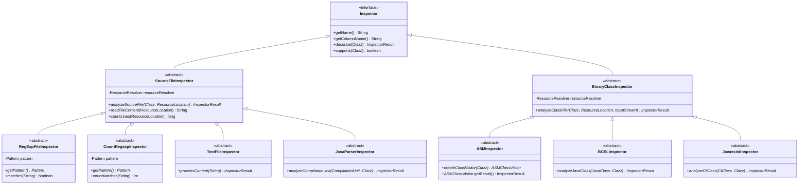

# Inspector Class Hierarchy Design

## Overview

This document outlines the design for the missing inspector base classes that need to be implemented to complete the purpose.md specification.

## Class Hierarchy Diagram



## Detailed Class Designs

### 1. RegExpFileInspector

```java
public abstract class RegExpFileInspector extends SourceFileInspector {
    
    private final Pattern pattern;
    
    protected RegExpFileInspector(ResourceResolver resourceResolver, String regexPattern) {
        super(resourceResolver);
        this.pattern = Pattern.compile(regexPattern);
    }
    
    protected RegExpFileInspector(ResourceResolver resourceResolver, Pattern pattern) {
        super(resourceResolver);
        this.pattern = pattern;
    }
    
    @Override
    protected final InspectorResult analyzeSourceFile(Clazz clazz, ResourceLocation sourceLocation) 
            throws IOException {
        String content = readFileContent(sourceLocation);
        boolean matches = pattern.matcher(content).find();
        return new InspectorResult(getColumnName(), matches);
    }
    
    /**
     * Subclasses can override to provide different pattern matching logic
     */
    protected boolean matches(String content) {
        return pattern.matcher(content).find();
    }
    
    /**
     * Get the compiled pattern for this inspector
     */
    protected Pattern getPattern() {
        return pattern;
    }
}
```

### 2. CountRegexpInspector

```java
public abstract class CountRegexpInspector extends SourceFileInspector {
    
    private final Pattern pattern;
    
    protected CountRegexpInspector(ResourceResolver resourceResolver, String regexPattern) {
        super(resourceResolver);
        this.pattern = Pattern.compile(regexPattern);
    }
    
    @Override
    protected final InspectorResult analyzeSourceFile(Clazz clazz, ResourceLocation sourceLocation) 
            throws IOException {
        String content = readFileContent(sourceLocation);
        int count = countMatches(content);
        return new InspectorResult(getColumnName(), count);
    }
    
    /**
     * Count regex pattern matches in the content
     */
    protected int countMatches(String content) {
        Matcher matcher = pattern.matcher(content);
        int count = 0;
        while (matcher.find()) {
            count++;
        }
        return count;
    }
    
    protected Pattern getPattern() {
        return pattern;
    }
}
```

### 3. TextFileInspector

```java
public abstract class TextFileInspector extends SourceFileInspector {
    
    protected TextFileInspector(ResourceResolver resourceResolver) {
        super(resourceResolver);
    }
    
    @Override
    protected final InspectorResult analyzeSourceFile(Clazz clazz, ResourceLocation sourceLocation) 
            throws IOException {
        String content = readFileContent(sourceLocation);
        return processContent(content, clazz);
    }
    
    /**
     * Process the file content and return analysis result.
     * Subclasses implement specific content analysis logic.
     */
    protected abstract InspectorResult processContent(String content, Clazz clazz);
}
```

### 4. JavaParserInspector

```java
public abstract class JavaParserInspector extends SourceFileInspector {
    
    private final JavaParser javaParser;
    
    protected JavaParserInspector(ResourceResolver resourceResolver) {
        super(resourceResolver);
        this.javaParser = new JavaParser();
    }
    
    protected JavaParserInspector(ResourceResolver resourceResolver, JavaParser customParser) {
        super(resourceResolver);
        this.javaParser = customParser;
    }
    
    @Override
    protected final InspectorResult analyzeSourceFile(Clazz clazz, ResourceLocation sourceLocation) 
            throws IOException {
        try {
            String content = readFileContent(sourceLocation);
            ParseResult<CompilationUnit> parseResult = javaParser.parse(content);
            
            if (!parseResult.isSuccessful()) {
                return InspectorResult.error(getColumnName(), 
                    "Parse errors: " + parseResult.getProblems().toString());
            }
            
            CompilationUnit cu = parseResult.getResult().orElse(null);
            if (cu == null) {
                return InspectorResult.error(getColumnName(), "Failed to parse compilation unit");
            }
            
            return analyzeCompilationUnit(cu, clazz);
            
        } catch (Exception e) {
            return InspectorResult.error(getColumnName(), "JavaParser error: " + e.getMessage());
        }
    }
    
    /**
     * Analyze the parsed compilation unit.
     * Subclasses implement specific AST analysis logic.
     */
    protected abstract InspectorResult analyzeCompilationUnit(CompilationUnit cu, Clazz clazz);
    
    protected JavaParser getJavaParser() {
        return javaParser;
    }
}
```

### 5. BCELInspector

```java
public abstract class BCELInspector extends BinaryClassInspector {
    
    protected BCELInspector(ResourceResolver resourceResolver) {
        super(resourceResolver);
    }
    
    @Override
    protected final InspectorResult analyzeClassFile(Clazz clazz, ResourceLocation binaryLocation,
            InputStream classInputStream) throws IOException {
        try {
            // Parse class file using BCEL
            ClassParser classParser = new ClassParser(classInputStream, clazz.getClassName());
            JavaClass javaClass = classParser.parse();
            
            return analyzeJavaClass(javaClass, clazz);
            
        } catch (ClassFormatException e) {
            return InspectorResult.error(getColumnName(), "BCEL class format error: " + e.getMessage());
        } catch (Exception e) {
            return InspectorResult.error(getColumnName(), "BCEL analysis error: " + e.getMessage());
        }
    }
    
    /**
     * Analyze the BCEL JavaClass representation.
     * Subclasses implement specific BCEL analysis logic.
     */
    protected abstract InspectorResult analyzeJavaClass(JavaClass javaClass, Clazz clazz);
}
```

### 6. JavassistInspector

```java
public abstract class JavassistInspector extends BinaryClassInspector {
    
    private final ClassPool classPool;
    
    protected JavassistInspector(ResourceResolver resourceResolver) {
        super(resourceResolver);
        this.classPool = ClassPool.getDefault();
    }
    
    protected JavassistInspector(ResourceResolver resourceResolver, ClassPool customClassPool) {
        super(resourceResolver);
        this.classPool = customClassPool;
    }
    
    @Override
    protected final InspectorResult analyzeClassFile(Clazz clazz, ResourceLocation binaryLocation,
            InputStream classInputStream) throws IOException {
        try {
            // Read class bytes and create CtClass
            byte[] classBytes = classInputStream.readAllBytes();
            CtClass ctClass = classPool.makeClass(new ByteArrayInputStream(classBytes));
            
            return analyzeCtClass(ctClass, clazz);
            
        } catch (RuntimeException e) {
            return InspectorResult.error(getColumnName(), "Javassist error: " + e.getMessage());
        } catch (Exception e) {
            return InspectorResult.error(getColumnName(), "Javassist analysis error: " + e.getMessage());
        }
    }
    
    /**
     * Analyze the Javassist CtClass representation.
     * Subclasses implement specific Javassist analysis logic.
     */
    protected abstract InspectorResult analyzeCtClass(CtClass ctClass, Clazz clazz);
    
    protected ClassPool getClassPool() {
        return classPool;
    }
}
```

## Implementation Guidelines

### 1. Error Handling Pattern
All inspectors must follow the established error handling pattern:
- Return `InspectorResult.error()` instead of throwing exceptions
- Provide meaningful error messages with context
- Log errors but continue analysis

### 2. Resource Management
- Use try-with-resources for all stream operations
- Leverage parent class helper methods (`readFileContent`, etc.)
- Handle large files efficiently through streaming

### 3. Constructor Patterns
- Always require `ResourceResolver` as first parameter
- Provide overloaded constructors for customization
- Follow existing naming conventions

### 4. Testing Strategy
Each inspector requires comprehensive tests:
- Positive test cases with expected results
- Negative test cases with malformed input
- Edge cases (empty files, binary data, etc.)
- Performance tests with large files

### 5. Documentation Standards
- Clear JavaDoc for all public/protected methods
- Usage examples in class-level documentation
- Parameter validation documentation

## Example Concrete Implementations

### Annotation Count Inspector
```java
public class AnnotationCountInspector extends CountRegexpInspector {
    
    public AnnotationCountInspector(ResourceResolver resourceResolver) {
        super(resourceResolver, "@\\w+");
    }
    
    @Override
    public String getName() {
        return "annotation-count";
    }
    
    @Override
    public String getColumnName() {
        return "Annotation Count";
    }
}
```

### Method Count Inspector (JavaParser)
```java
public class MethodCountInspector extends JavaParserInspector {
    
    public MethodCountInspector(ResourceResolver resourceResolver) {
        super(resourceResolver);
    }
    
    @Override
    protected InspectorResult analyzeCompilationUnit(CompilationUnit cu, Clazz clazz) {
        int methodCount = cu.findAll(MethodDeclaration.class).size();
        return new InspectorResult(getColumnName(), methodCount);
    }
    
    @Override
    public String getName() {
        return "method-count";
    }
    
    @Override
    public String getColumnName() {
        return "Method Count";
    }
}
```

This design provides a solid foundation for implementing all the missing inspector base classes while maintaining consistency with the existing architecture.
