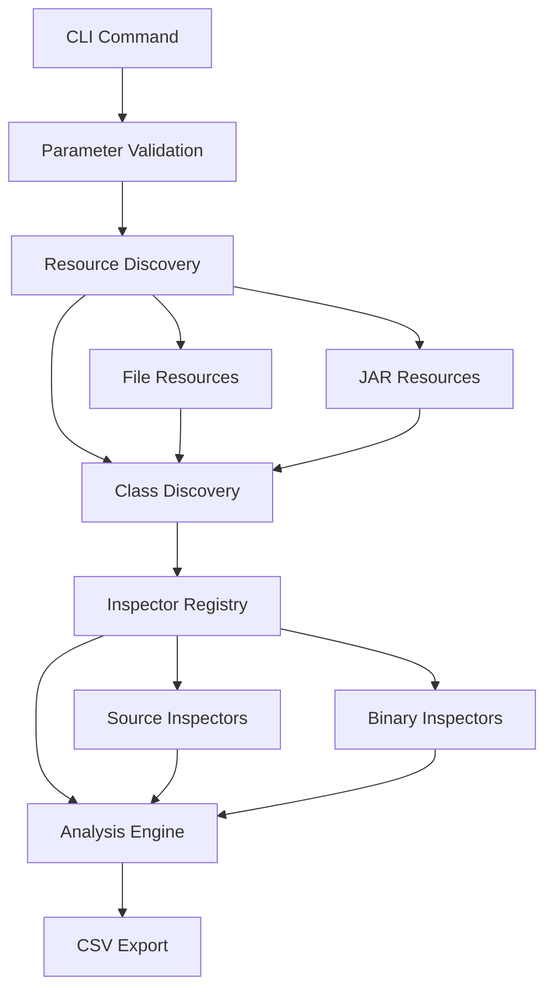

# System Patterns and Architecture

## Core Architectural Pattern: Inspector Pattern

The system is built around the **Inspector Pattern** - a variation of the Visitor pattern that allows different analysis operations to be performed on class objects without modifying the core class structure.

### Key Components

#### 1. Inspector Interface
```java
public interface Inspector<T> {
    String getName();
    String getColumnName();
    InspectorResult decorate(T target);
    boolean supports(T target);
}
```

#### 2. Enhanced Inspector Hierarchy ✅ COMPLETE
**Binary Analysis Base Classes:**
- **`BinaryClassInspector`**: Core base for all bytecode analysis
- **`ASMInspector`**: Template method pattern for ASM-based analysis
- **`BCELInspector`**: Apache BCEL bytecode analysis foundation
- **`JavassistInspector`**: Runtime bytecode manipulation base

**Source Analysis Base Classes:**
- **`SourceFileInspector`**: Core base for all source code analysis
- **`RegExpFileInspector`**: Pattern matching with validation and error handling
- **`CountRegexpInspector`**: Pattern occurrence counting with robust logic
- **`TextFileInspector`**: Full content extraction with abstract processContent
- **`JavaParserInspector`**: AST-based Java parsing foundation
- **`RoasterInspector`**: Code generation and manipulation base
- **`SonarParserInspector`**: Advanced parsing with SonarSource integration

#### 3. Resource Resolution Pattern
**Unified Resource Access**: URI-based system supporting multiple sources
- `ResourceResolver`: Interface for accessing resources by URI
- `FileResourceResolver`: File system access
- `JarResourceResolver`: JAR/WAR/ZIP file access
- `CompositeResourceResolver`: Combines multiple resolvers

#### 4. Package Structure Enhancement ✅ NEW
**Organized Inspector Hierarchy**: Moved from flat structure to organized core packages
```
src/main/java/com/analyzer/inspectors/
├── core/
│   ├── binary/          # Binary analysis base classes
│   │   ├── ASMInspector.java
│   │   ├── BCELInspector.java
│   │   ├── BinaryClassInspector.java
│   │   └── JavassistInspector.java
│   └── source/          # Source analysis base classes
│       ├── CountRegexpInspector.java
│       ├── JavaParserInspector.java
│       ├── RegExpFileInspector.java
│       ├── RoasterInspector.java
│       ├── SonarParserInspector.java
│       ├── SourceFileInspector.java
│       └── TextFileInspector.java
├── packages/            # Package-level inspectors
└── rules/              # Concrete rule implementations
    ├── binary/
    └── source/
```

### Analysis Workflow



## Design Patterns Used

### 1. Factory Pattern
- **`InspectorRegistry`**: Creates and manages inspector instances
- **`ResourceResolver`**: Factory for accessing different resource types

### 2. Strategy Pattern
- **Inspector implementations**: Different analysis strategies
- **Resource resolvers**: Different access strategies

### 3. Template Method Pattern
- **`ASMInspector`**: Common ASM workflow with customizable visitor creation
- **Base inspector classes**: Common validation and error handling

### 4. Composite Pattern
- **`CompositeResourceResolver`**: Combines multiple resolver strategies
- **Analysis results**: Hierarchical result structures

## Error Handling Strategy

### Graceful Degradation
- Individual inspector failures don't stop entire analysis
- Missing resources result in "N/A" values, not errors
- Comprehensive error logging with context

### Result Types
- **Success**: Contains analysis result value
- **Not Applicable**: Inspector doesn't support this class type
- **Error**: Inspection failed with error message

## Extension Points

### 1. Custom Inspectors ✅ ENHANCED
**Binary Analysis Extensions:**
- Extend `ASMInspector` for specialized ASM-based analysis
- Extend `BCELInspector` for Apache BCEL bytecode inspection
- Extend `JavassistInspector` for runtime manipulation analysis
- Extend base `BinaryClassInspector` for custom bytecode approaches

**Source Analysis Extensions:**
- Extend `RegExpFileInspector` for pattern-based analysis
- Extend `CountRegexpInspector` for occurrence counting
- Extend `TextFileInspector` for full content processing
- Extend `JavaParserInspector` for AST-based analysis
- Extend `RoasterInspector` for code generation analysis
- Extend `SonarParserInspector` for advanced parsing
- Extend base `SourceFileInspector` for custom source approaches

**Implementation Requirements:**
- Implement required abstract methods (getName(), getColumnName())
- Follow error handling patterns (return InspectorResult.error() vs throwing)
- Package as JAR in plugins directory for dynamic loading

### 2. Custom Resource Resolvers
- Implement `ResourceResolver` interface
- Add to `CompositeResourceResolver`
- Support new URI schemes

### 3. Export Formats
- Current: CSV export via `CsvExporter`
- Future: JSON, XML, custom format exporters

## Critical Implementation Paths

### Class Discovery Flow
1. **URI Conversion**: Convert file paths to URIs
2. **Resource Resolution**: Resolve URIs to actual resources
3. **Class Enumeration**: List all classes in resources
4. **Metadata Extraction**: Extract class name, location, type

### Inspector Execution Flow
1. **Registry Lookup**: Find requested inspectors
2. **Support Check**: Verify inspector supports class
3. **Analysis Execution**: Run inspector on class
4. **Result Collection**: Gather all inspector results

### Error Recovery Patterns
- **Resource not found**: Log warning, continue with available resources
- **Class parsing error**: Mark as error, continue with other classes
- **Inspector failure**: Log error, mark result as failed, continue with other inspectors
