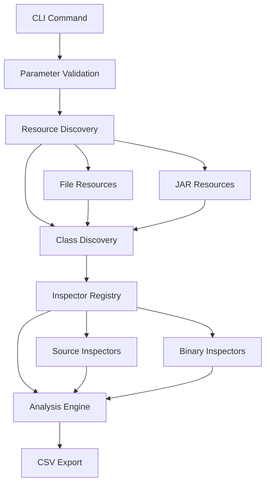

# System Patterns and Architecture

## Core Architectural Pattern: Inspector Pattern

The system is built around the **Inspector Pattern** - a variation of the Visitor pattern that allows different analysis operations to be performed on class objects without modifying the core class structure.

### Key Components

#### 1. Inspector Interface
```java
public interface Inspector<T> {
    String getName();
    String getColumnName();
    InspectorResult decorate(T target);
    boolean supports(T target);
}
```

#### 2. Base Inspector Classes
- **`SourceFileInspector`**: Base for source code analysis
- **`BinaryClassInspector`**: Base for bytecode analysis  
- **`ASMInspector`**: Specialized ASM-based bytecode analysis

#### 3. Resource Resolution Pattern
**Unified Resource Access**: URI-based system supporting multiple sources
- `ResourceResolver`: Interface for accessing resources by URI
- `FileResourceResolver`: File system access
- `JarResourceResolver`: JAR/WAR/ZIP file access
- `CompositeResourceResolver`: Combines multiple resolvers

### Analysis Workflow



## Design Patterns Used

### 1. Factory Pattern
- **`InspectorRegistry`**: Creates and manages inspector instances
- **`ResourceResolver`**: Factory for accessing different resource types

### 2. Strategy Pattern
- **Inspector implementations**: Different analysis strategies
- **Resource resolvers**: Different access strategies

### 3. Template Method Pattern
- **`ASMInspector`**: Common ASM workflow with customizable visitor creation
- **Base inspector classes**: Common validation and error handling

### 4. Composite Pattern
- **`CompositeResourceResolver`**: Combines multiple resolver strategies
- **Analysis results**: Hierarchical result structures

## Error Handling Strategy

### Graceful Degradation
- Individual inspector failures don't stop entire analysis
- Missing resources result in "N/A" values, not errors
- Comprehensive error logging with context

### Result Types
- **Success**: Contains analysis result value
- **Not Applicable**: Inspector doesn't support this class type
- **Error**: Inspection failed with error message

## Extension Points

### 1. Custom Inspectors
- Extend `SourceFileInspector` or `BinaryClassInspector`
- Implement `decorate()` method
- Package as JAR in plugins directory

### 2. Custom Resource Resolvers
- Implement `ResourceResolver` interface
- Add to `CompositeResourceResolver`
- Support new URI schemes

### 3. Export Formats
- Current: CSV export via `CsvExporter`
- Future: JSON, XML, custom format exporters

## Critical Implementation Paths

### Class Discovery Flow
1. **URI Conversion**: Convert file paths to URIs
2. **Resource Resolution**: Resolve URIs to actual resources
3. **Class Enumeration**: List all classes in resources
4. **Metadata Extraction**: Extract class name, location, type

### Inspector Execution Flow
1. **Registry Lookup**: Find requested inspectors
2. **Support Check**: Verify inspector supports class
3. **Analysis Execution**: Run inspector on class
4. **Result Collection**: Gather all inspector results

### Error Recovery Patterns
- **Resource not found**: Log warning, continue with available resources
- **Class parsing error**: Mark as error, continue with other classes
- **Inspector failure**: Log error, mark result as failed, continue with other inspectors
